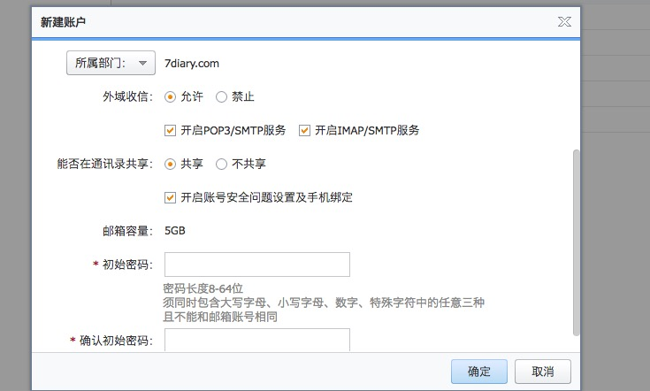
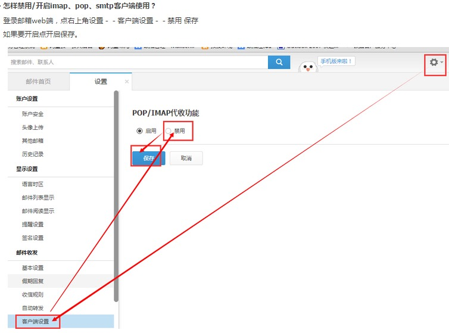

#### 1.如何开启smtp或pop3
smtp或pop3是企业邮箱管理员在创建你的账号创建时候设置是否开启的，而一般情况你的smtp和pop3也是默认开启的。

#### 2.在foxmail等第三方邮箱登陆时候，如何设置地址：
````
协议	服务器地址	服务器端口号（常规）	服务器端口号（加密）
POP3	pop3.mxhichina.com	110	995
SMTP	smtp.mxhichina.com	25	465
IMAP	imap.mxhichina.com	143	993
````
------
#### 3.阿里个人邮箱，需要自己开通smtp或pop3服务：


#### 4.阿里个人邮箱的话，地址配置如下：
````
协议	服务器地址	服务器端口号（常规）	服务器端口号（加密）
POP3	pop3.aliyun.com	110	995
SMTP	smtp.aliyun.com	25	465
IMAP	imap.aliyun.com	143	993
````